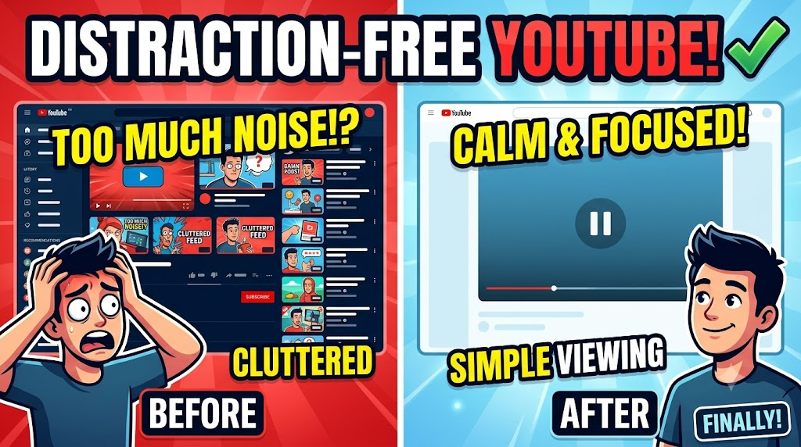

# Mini-Projects
This repo contains the source code of mini projects using html,css,js which every student can practice during learning 

1st Project - It is a Distraction Free YouTube which contains some of my Favourite Content